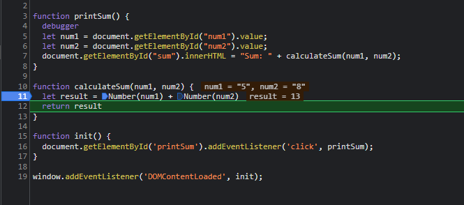

1. The bug is that the inputs are parsed as strings, so the result is a concatenation of the two inputs. When 5 and 8 are inputted, it becomes 58.
2. I fixed the error by casting num1 and num2 to numbers using Number(num1) and Number(num2)
